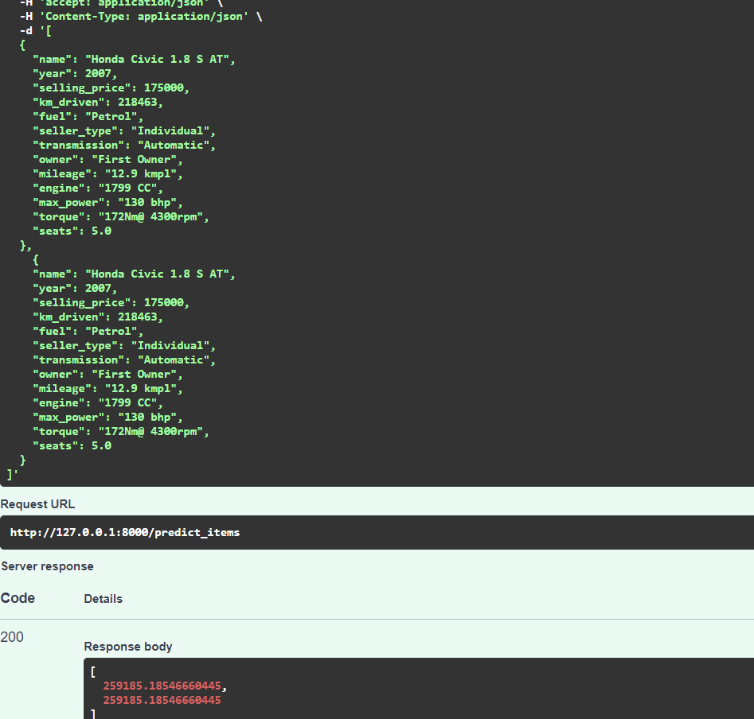
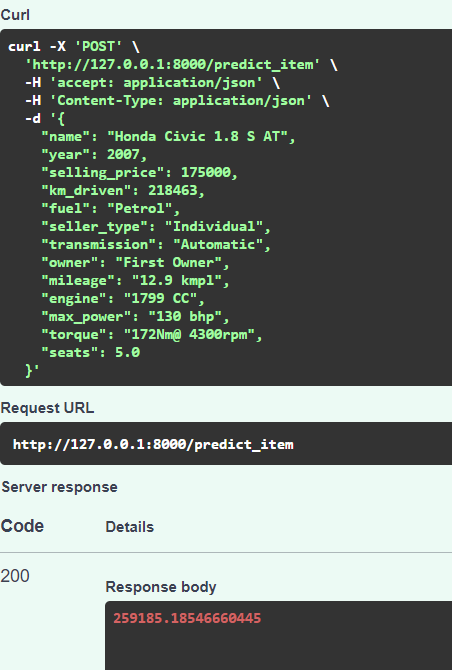

В данной работе сделано по заданиям:

1. Препроцессинг данных.
Удалены дубликаты
Заменены пропуски медианными значениями
Скорректированы форматы данных

2. Обучение.
Применены линейная модель, модели с регуляризацией.
Параметры моделей сохранены в файл pickle

3. Внедрение
Написан сервис на FastAPI. 
Принимает данные, выдает прогноз по обученной модели

Дополнительно:
1. Препроцессинг. 
Добавлены квадратичные признаки. 
Целевая переменная приведена к нормальному распределению
2. Обучение.
Препроцессинг, обучение  поиск гиперпараметров объединены в Pipeline.

Выводы:
1. Pipeline - это удобно.
2. Наибольший вклад в качество модели дает работа предобработка данных

Ниже - printscreen работы FastAPI

